# sysinfo

#### 简介

sysinfo 使用 Python Flask 框架和 psutil 开发的一个中文版 Linux 服务器信息查看应用，可查看的信息包括系统、CPU、内存、硬盘、进程、网络、登录用户等，同时可查看并导出部分数据的图表。

#### 需要安装的 Python 包

- flask

- psutil

- netifaces

#### 运行

1. 下载或使用 `git clone` 获取源代码

2. 进入目录执行 `python run.py` 启动应用

3. web 页面访问 [http://localhost:9468](http://localhost:9468) ，修改 [auto-refresh.js](./static/js/auto-refresh.js) 文件中的 `notRefresh` 可配置是否自动刷新。

#### 运行截图

- 首页 / 系统信息

 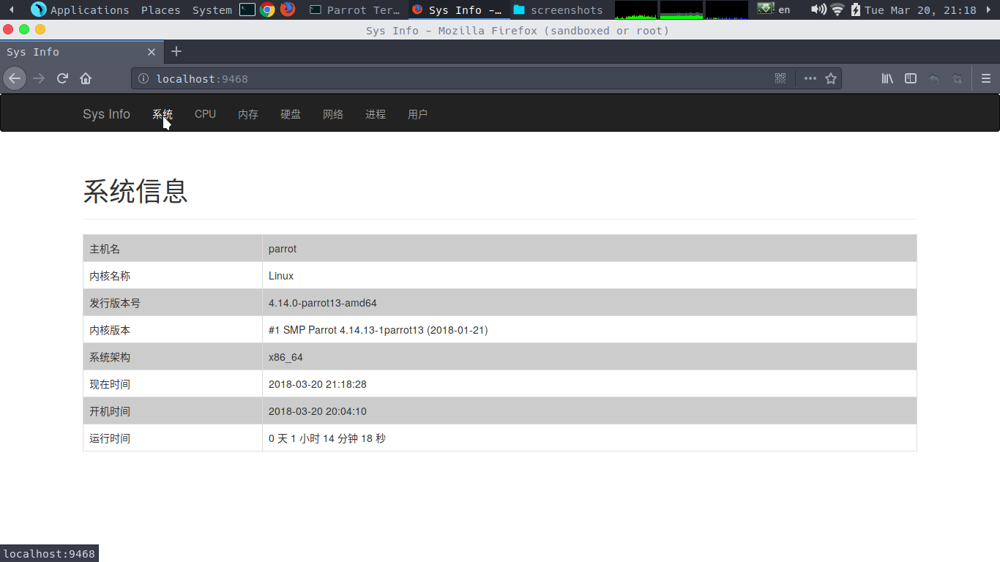

- CPU 信息

 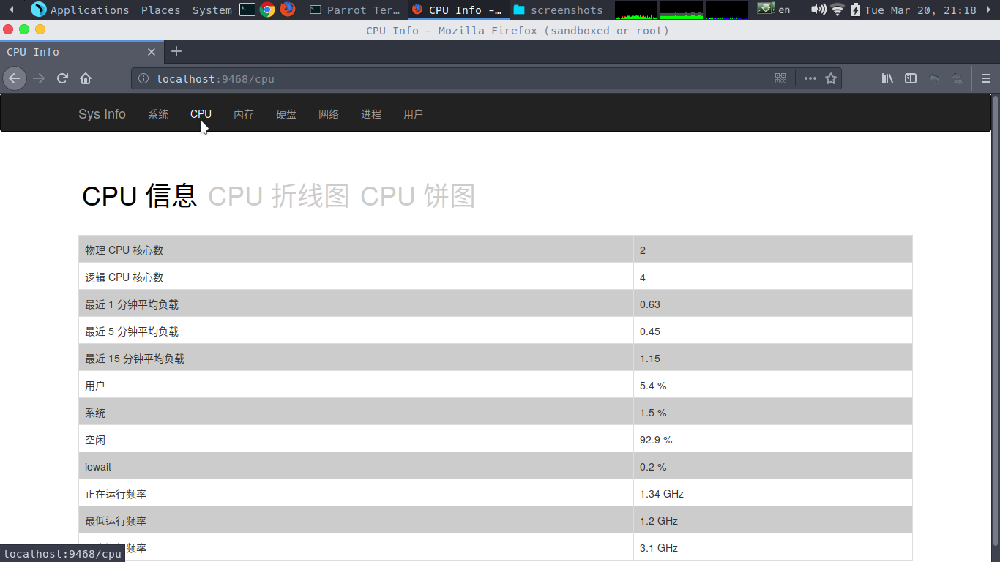

 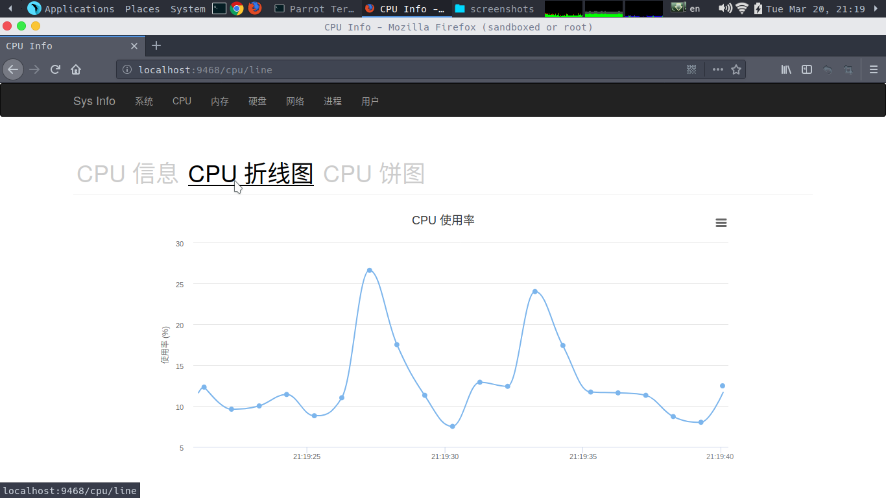

 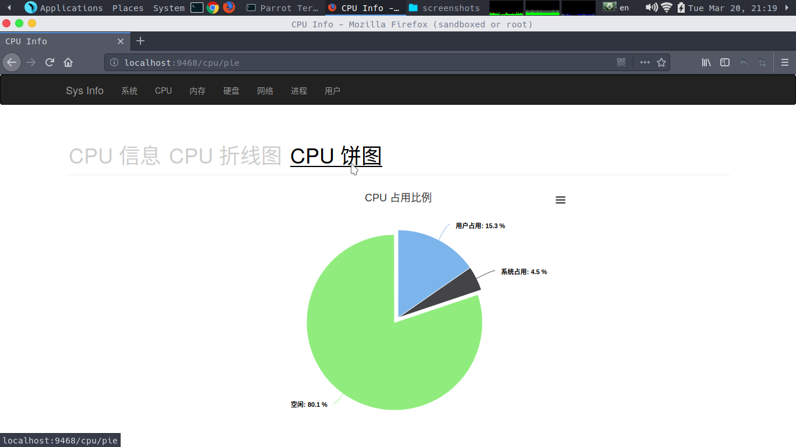

- 内存信息

 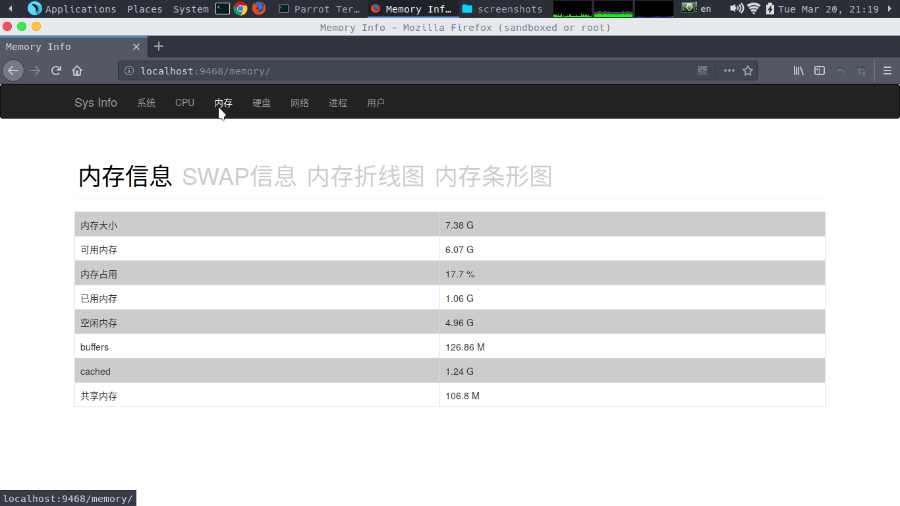

 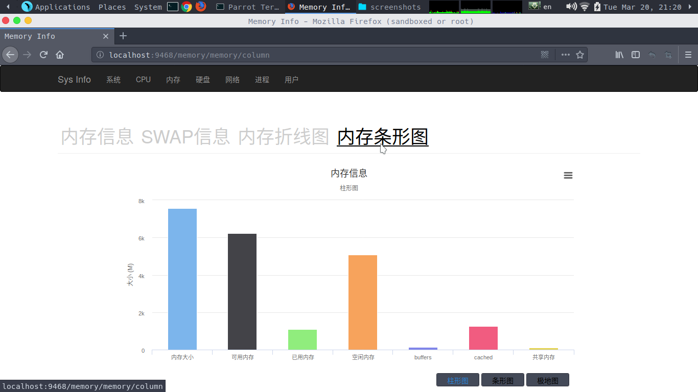
 （此图可点击选择展示类型）

- 硬盘信息

 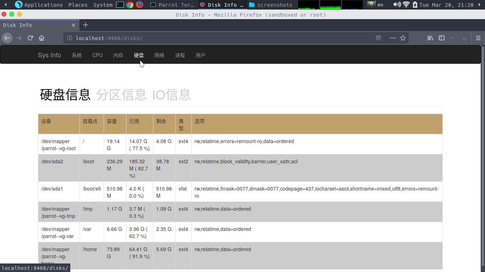

- 网络信息

    1.网络信息

    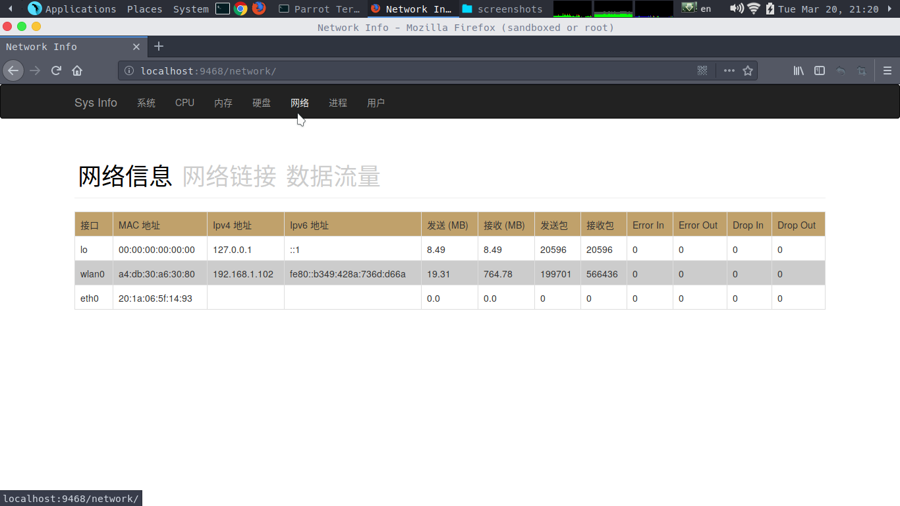

    2.数据流量

    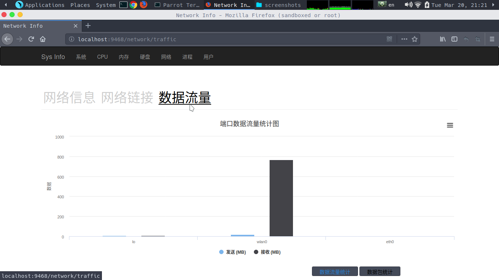

- 进程信息

 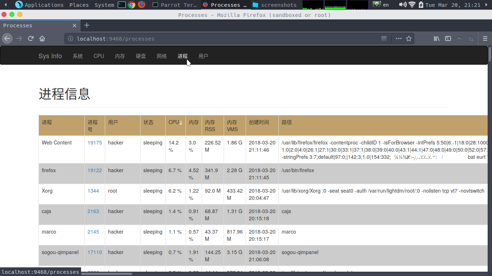

- 单个进程详细信息

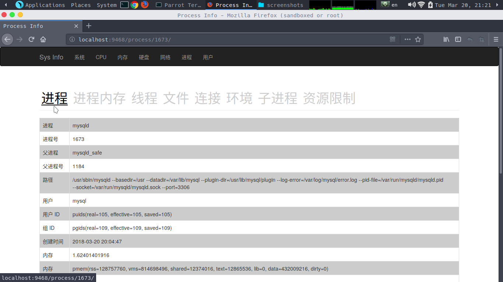

- 登录用户

 

#### 致谢

上述图表均通过 [Highcharts](https://www.highcharts.com/) 绘制。