# sysinfo

#### 简介

sysinfo 使用 Python Flask 框架和 psutil 开发的一个中文版 Linux 服务器信息查看应用，可查看的信息包括系统、CPU、内存、硬盘、进程、网络、登录用户等。

#### 需要安装的 Python 包

- flask
- psutil
- netifaces

#### 运行

1. 下载或使用 `git clone` 获取源代码

2. 进入目录执行 `python run.py` 启动应用

3. web 页面访问 [http://localhost:9468](http://localhost:9468) ，修改 [auto-refresh.js](./static/js/auto-refresh.js) 文件中的　`notRefresh`　可配置是否自动刷新，默认每 3 秒刷新一次。

#### 运行截图

- 首页 / 系统信息 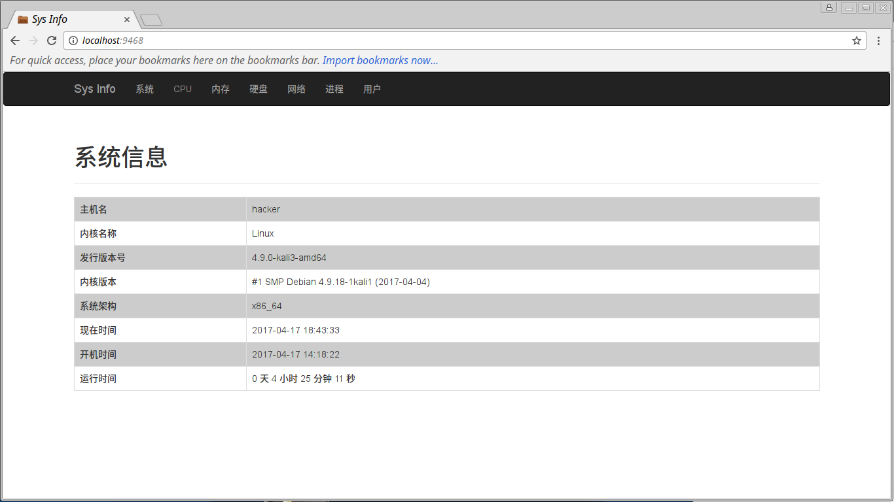

- CPU 信息 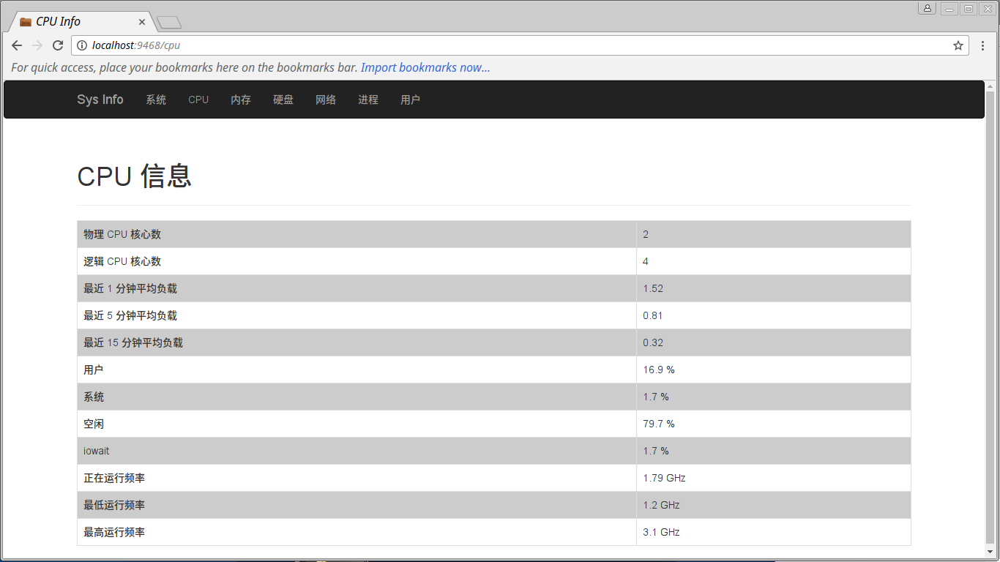

- 内存信息

    1.内存信息 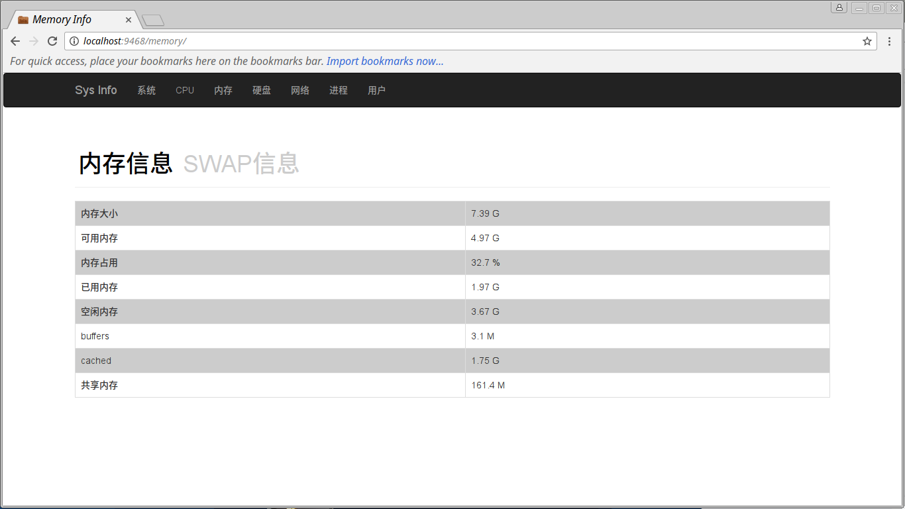
    
    2.SWAP 信息 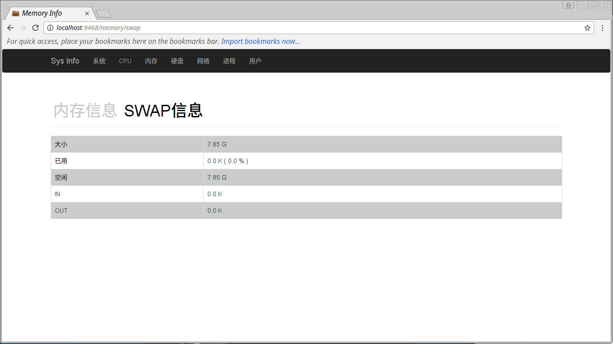
    
- 硬盘信息

    1.硬盘信息 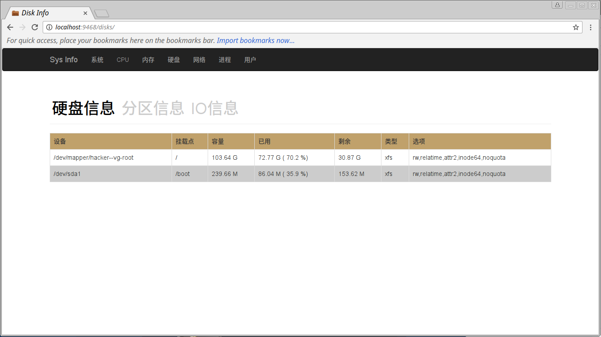
    
    2.分区信息 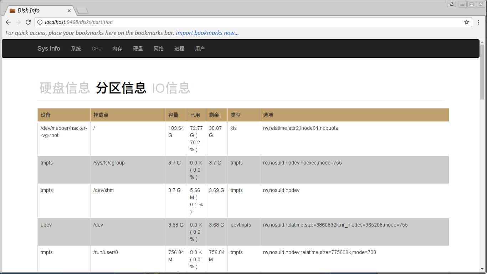
    
    3.IO 信息 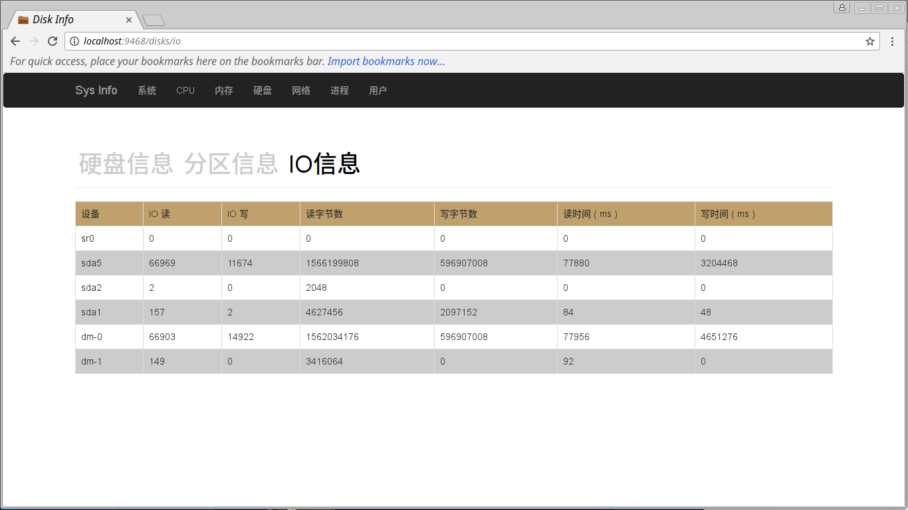
    
- 网络信息

    1.网络信息 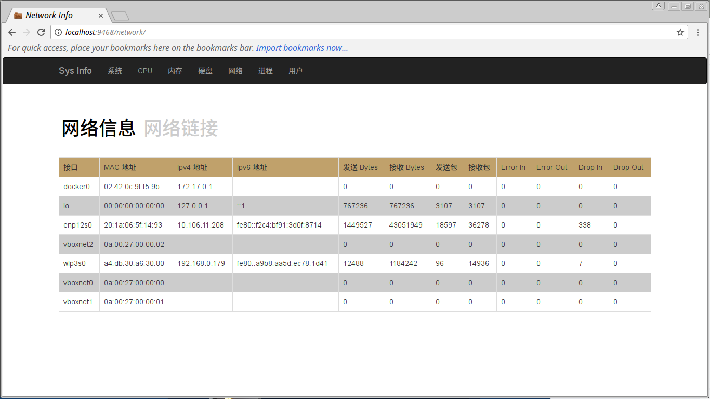
    
    2.连接信息 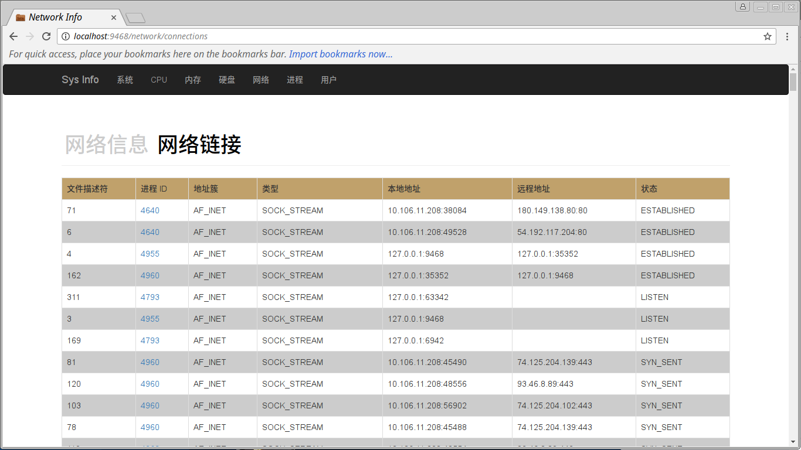
    
- 进程信息 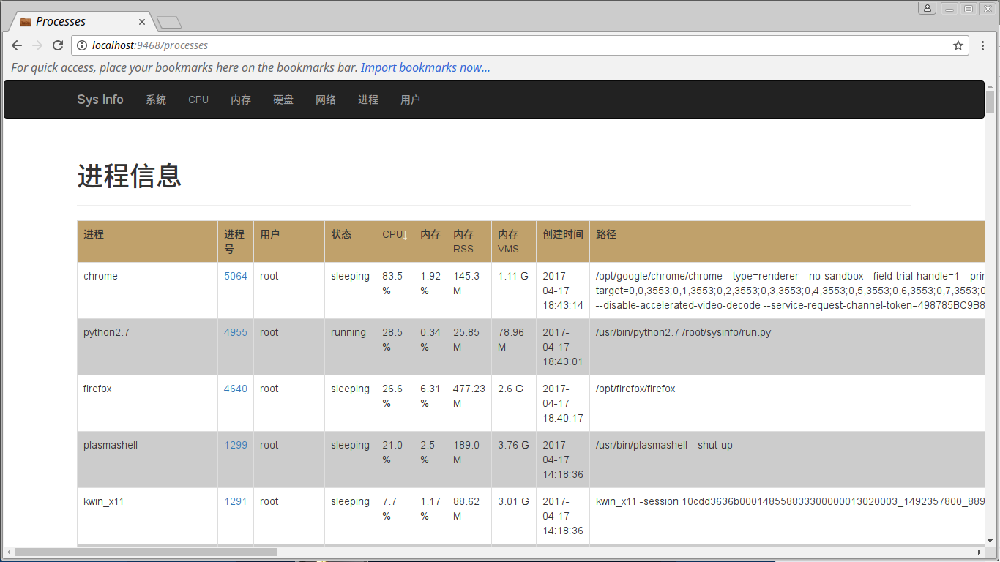

- 单个进程详细信息 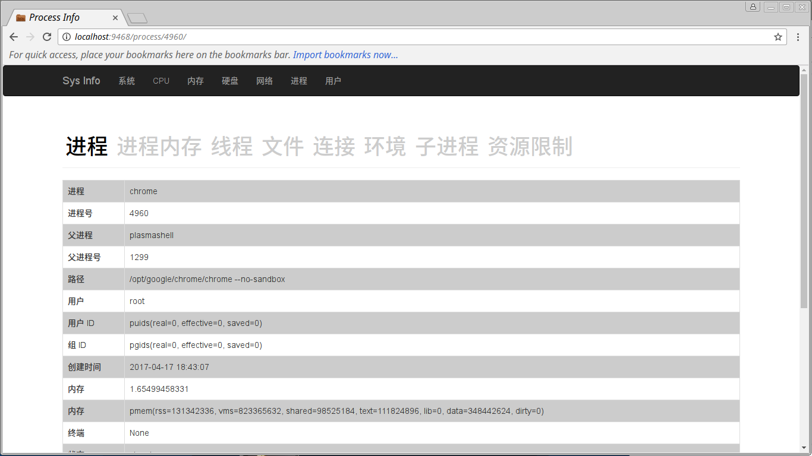

- 登录用户 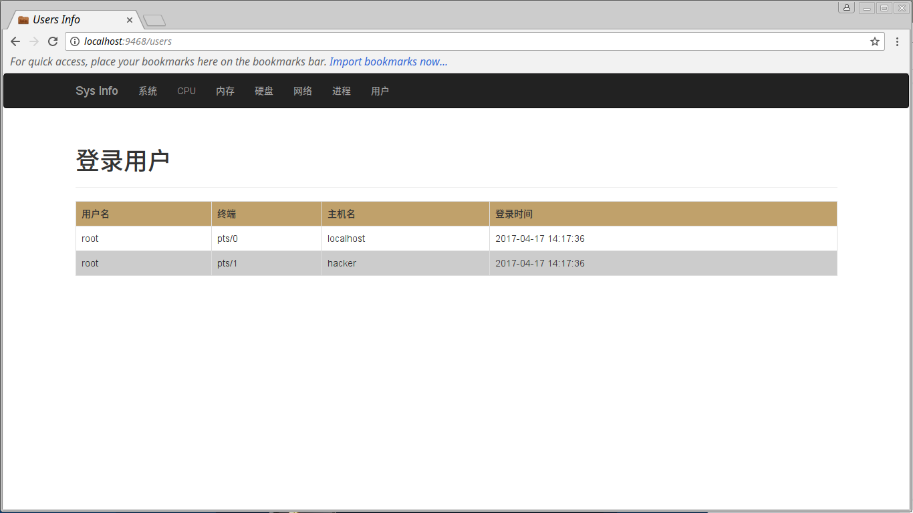